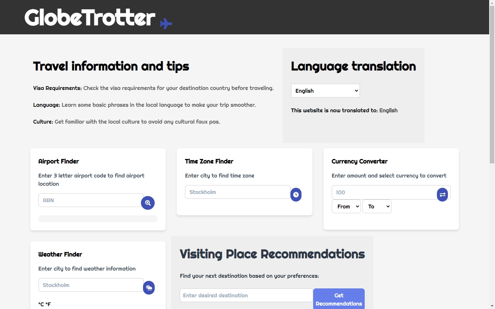

# GlobeTrotter

## User Story
If you are a frequent traveler, you may want to have a dashboard that can be displayed on your phone or computer to view airport locations in different cities, the current timezone in a specified country, and currency exchange rates between two countries.
## Try it out here: [GlobeTrotter](https://menara-travel.vercel.app/)

## Technologies Used

The following technologies were used in the development of this web application:

- HTML
- CSS
- JQuery
- Tailwind CSS
- REST API
- MomentJS

## Preview

Here's a preview of the web app:

## APIs Utilized

The following APIs were used to retrieve airport locations, timezones, currency exchange rates, and weather information:

  [Airport API] (https://www.nominatim.openstreetmap.org/)
  [Timezone API] (https://openweathermap.org/api)
  [Currency API] (https://api.exchangerate.host/)
  [Weather API] (https://openweathermap.org/api)
