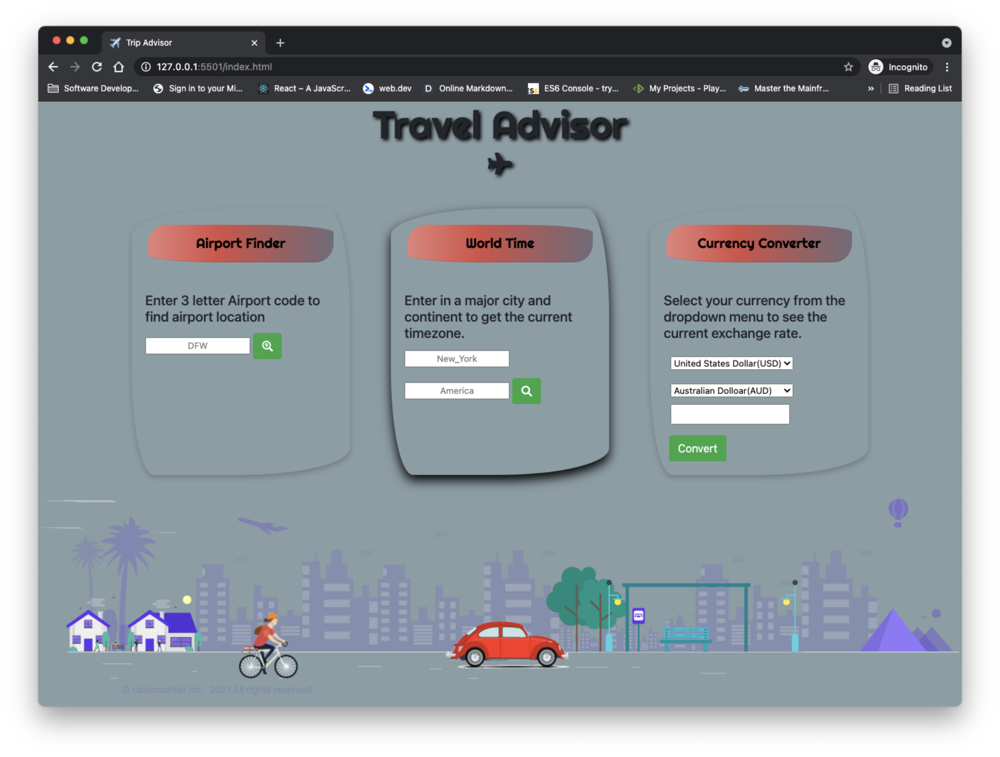

# Travel Advisor

## User Story
As a frequent traveler, I want to be able to keep a dashboard that displayed on my phone or computer that allows me to look at airports location in different cities, the current timezone in a specified country, and the exchange rate of currency between two countries.

## [Try it](https://menara-travel.vercel.app/)

## Technology
- HTML
- CSS
- JQuery 
- Bootstrap
- REST API
- MomentJS

The following image shows a preview of the web app:



### Below are the following API's used to retrieve airports, timezones, and currency exchange rates:

1. [AirportIX](https://rapidapi.com/neelers/api/airportix?endpoint=apiendpoint_29dd263ad6mshc1112f72b21d1dcp179f5ejsn33dcadd6248f) 

2. [WorldTime](https://rapidapi.com/brianiswu/api/world-time2)

3. [Currency](https://rapidapi.com/natkapral/api/currency-converter5)

## Future
```sh
mapQuest API
migration from jQuery to vanilla JS
PWA
```# menara-travel
